# WhatsApp Fitness Coaching Bot - Product Requirements Document
## Python-Based 20-User Experiment

## 1. Product Overview
AI-powered fitness coaching delivered via WhatsApp that discovers individual failure patterns and adapts workout plans to improve consistency over a 14-day experiment.

Plans are fully personalized by AI and can include any activity type (gym workouts, walking, running, yoga, fitness classes, etc.) - the focus is on discovering WHEN and WHY users succeed or fail, not dictating what exercises to do.

## 2. Core Value Proposition

- Traditional fitness apps give one-size-fits-all plans that don't account for real life
- This bot DISCOVERS why each user specifically fails, then adapts the plan to their chaotic life
- Delivered via WhatsApp (no app download, no new habit to form)
- Data-driven pattern discovery beats generic fitness advice

## 3. Target Users

- **Primary:** Busy parents (25-45) who've quit gym memberships multiple times
- **Secondary:** Anyone with inconsistent fitness history despite good intentions
- **Pain point:** "I'm good for 6 weeks, then something happens and I stop"
- **Common triggers:** Work deadlines, sick kids, travel, lack of sleep, guilt spirals

## 4. Key Features

### Phase 1 (MVP - 14-Day Experiment with 20 Users)

- WhatsApp-based onboarding (5 questions, ~3 minutes)
- AI-generated personalized Week 1 workout plan (displays type, days, sample exercises)
- Daily automated check-ins (London/Dublin timezone):
  - Morning check-in (6am)
  - Evening check-in (8pm)
- Day 7: AI pattern discovery analysis
- Week 2: Adaptive plan based on discovered patterns
- Day 14: Final analysis + sustainability recommendations

### Phase 2 (Future - Post-MVP)

- Ongoing coaching beyond 14 days
- Exercise video library via WhatsApp
- Group challenges / community features
- Payment integration (subscription model)
- Admin dashboard for coaches to review users

## 5. User Flows

### Flow 1: New User Onboarding (5-8 minutes)
```
User → Sends "START" to WhatsApp number
  ↓
Bot → Welcome message:
      "Welcome to your 14-Day Fitness Consistency Experiment! 🎯

      I'm not here to give you another perfect plan you'll feel guilty about breaking.
      I'm here to discover YOUR specific patterns and what actually works for your life.

      Ready? Let's start with 5 quick questions."
  ↓
Bot → Question 1: "What's your current fitness level?
      - Beginner (new to exercise)
      - Intermediate (workout 1-3x/week)
      - Advanced (workout 4+x/week)

      Any injuries I should know about?"
  ↓
User → "Intermediate. Lower back gets cranky."
  ↓
Bot → Question 2: "What's your ideal workout?
      - What TIME of day feels most realistic? (morning/lunch/evening)
      - Where? (home/gym/either)
      - How long? (15/30/45 min if everything goes perfectly)"
  ↓
User → "6am, home, 30 minutes"
  ↓
Bot → Question 3: "Tell me about your week structure.
      - Which days are typically your HARDEST? (meetings, kid activities, etc.)
      - Any recurring commitments? (Monday soccer, Friday date night, etc.)"
  ↓
User → "Wednesdays are brutal - 8am meeting. Thursdays my son has soccer at 5pm."
  ↓
Bot → Question 4: "When you've quit fitness programs before:
      - Was it gradual or sudden?
      - What was happening in your life?
      - If you DID stick with it for a while, what was different?"
  ↓
User → "Gradual then sudden. Usually after missing a few days I just stop.
        Worked when I had a workout buddy who texted me."
  ↓
Bot → Question 5: "What would make these 14 days feel successful?
      Not 'lose 10 lbs' - I mean what would prove this experiment worked?

      Example: 'I want to prove I can handle a missed workout without spiraling'"
  ↓
User → "I want to do 10 out of 14 days and understand WHY I missed the other 4."
  ↓
Bot → "Perfect! Let me create your personalized plan..."
  ↓
System → Sends user data to Claude API to generate personalized workout plan
        (can be ANY type: gym workouts, walking, running, yoga, classes, etc.)
        Key: track WHEN workouts happen
  ↓
Bot → "📋 YOUR WEEK 1 PLAN

      **3 workout days:** Monday, Wednesday, Friday
      **Type:** Push/Pull/Legs split

      - Monday: Push (chest, shoulders, triceps)
        → Push-ups, shoulder press, tricep dips

      - Wednesday: Pull (back, biceps)
        → Rows, bicep curls, lat pulldowns

      - Friday: Legs (quads, hamstrings, glutes)
        → Squats, lunges, glute bridges

      Each workout: ~30 minutes at home"

      [Sends detailed workout schedule]

      "I'll check in tomorrow at 6am.

      One important thing: I need you to check in EVERY day - even rest days,
      even if you skip. Especially if you skip. That's where the good data is.

      Questions before we start?"
  ↓
User → "Nope, let's do this"
  ↓
Bot → "Awesome. See you tomorrow at 6am! 💪"
  ↓
System → Sets user state to "week_1_active", day 0
System → Schedules first morning check-in for 6am London/Dublin time
```

### Flow 2: Daily Morning Check-in (90 seconds)
```
6:00am (scheduled, London/Dublin time)
  ↓
Bot → "☀️ Good morning [Name]!

      Quick check-in (90 sec):

      Reply with:
      Sleep: [hours]
      Energy: [1-10]
      Stress: [1-10]
      Confidence: [0-10]

      Today's workout: [Full Body Strength - 25min]

      Ready?"
  ↓
User → "Sleep: 6.5
        Energy: 7
        Stress: 4
        Confidence: 8"
  ↓
System → Parses response, saves to database
System → Validates format (if invalid, asks for clarification)
  ↓
Bot → "Got it! 💪

      Confidence at 8/10 - that's solid.

      Have a great workout!"
  ↓
System → Updates user state: morning_checkin_complete
System → Schedules evening check-in for 8pm
```

### Flow 3: Daily Evening Check-in (90 seconds)
```
8:00pm (scheduled, user's timezone)
  ↓
Bot → "🌙 Evening check-in

      Planned: [Full Body Strength - 25min]
      Actual: [what really happened?]

      Reply: COMPLETED / SKIPPED / MODIFIED"
  ↓
User → "COMPLETED - 27 minutes"
  ↓
Bot → "Fantastic! 🎉

      Day 1 done. Any concerns about tomorrow?"
  ↓
User → "Nervous about keeping momentum"
  ↓
Bot → "Noted. I'm tracking that.

      Tomorrow is active recovery - just 15min of light movement.

      Rest up!"
  ↓
System → Saves check-in data
System → Increments day counter
System → Updates state to ready for next morning check-in

--- ALTERNATIVE PATH: User Skipped ---

User → "SKIPPED"
  ↓
Bot → "No judgment - this is data.

      What happened?"
  ↓
User → "Kid had nightmare at 6am, by the time I settled her I had to get ready for work"
  ↓
Bot → "That's valuable info.

      When did you realize you'd skip?
      - Morning? Mid-day? Last minute?"
  ↓
User → "The moment she woke up crying around 6:10am"
  ↓
Bot → "Got it. Kids don't follow workout plans 😊

      Quick question: What might have helped?
      (Your honest guess - there may not be a good answer)"
  ↓
User → "Maybe if I'd started at 5:50am instead of 6:05?
        But also I'm not waking up earlier."
  ↓
Bot → "That's the kind of insight I'm looking for.

      I'm noting:
      - Interrupted at 6:10am → skip
      - 15min delay = couldn't recover

      We'll look for patterns after Week 1.

      Tomorrow's another shot. Any concerns about it?"
  ↓
System → Saves detailed skip data
System → Tags: interruption, timing_issue, kid_emergency
```

### Flow 4: Day 7 Pattern Analysis (15-20 minutes total interaction)
```
Day 7, 8:00pm - User completes final evening check-in
  ↓
Bot → "Week 1 complete! 🎉

      You did [3/5] planned workouts.

      Give me 5 minutes to analyze your patterns.
      This is where it gets interesting..."
  ↓
System → Loads all Week 1 check-in data
System → Builds comprehensive context for Claude
System → Sends to Claude API with analysis prompt
  ↓
Claude → Analyzes patterns (receives full week data + system prompt)
Claude → Returns structured analysis with:
         - 3-5 discovered patterns
         - Evidence for each pattern
         - Specific predictions
         - Week 2 adaptations
  ↓
Bot → Sends analysis in digestible chunks (5-7 messages):

      Message 1:
      "📊 WEEK 1 ANALYSIS

      I dug into your data and found some really interesting patterns..."

      Message 2:
      "**Pattern #1: The Confidence Paradox**

      Your morning confidence score predicted completion with 90% accuracy:
      - Confidence 8-10 → 100% completion ✅
      - Confidence 6-7 → 50% completion
      - Confidence 0-5 → 0% completion ❌

      Your gut feeling is HIGHLY accurate."

      Message 3:
      "**Pattern #2: The 24-Hour Spiral**

      Thursday skip → Friday confidence dropped (6→4) → Friday skip
      But Saturday confidence rose to 8 → completed

      Discovery: You don't spiral for weeks - just 24 hours!
      By day 2 after a skip, you naturally reset."

      Message 4:
      "**Pattern #3: Start Time Window**

      All completed workouts: Started before 6:10am
      Both skips: Decision made after 6:15am

      You have a ~5 minute decision window (6:00-6:05am).
      After that, you start negotiating with yourself."

      Message 5:
      "**What This Means for Week 2**

      I'm testing 3 interventions based on YOUR patterns:

      1. Night-before commitment (avoid morning negotiation)
      2. Built-in 'Lite' versions (12min workouts for hard days)
      3. Friday locked at 12min (no decision fatigue)

      Let's see if these adaptations work for you."

      Message 6:
      "**Your Week 2 Plan**

      [Sends formatted schedule - similar to Week 1 but with adaptations]

      Key changes:
      - Wednesday still REST (your hardest day)
      - Thursday & Friday have 12min 'lite' options
      - Every night you'll commit to next day's workout
      - New evening check-in: 'tomorrow's workout' choice"

      Message 7:
      "Questions about the plan?

      Or ready to start Week 2 on Monday?"
  ↓
User → "This is actually really insightful. Ready to start."
  ↓
Bot → "Awesome. Week 2 starts Monday.

      Tonight (Sunday), I'll ask for your first night-before commitment.

      Enjoy your rest day tomorrow! 🎉"
  ↓
System → Updates user state: week_2_active, day 0
System → Saves pattern analysis to database
System → Generates Week 2 workout plan with adaptations
```

### Flow 5: Week 2 Night-Before Commitment (New Feature)
```
Sunday 9:00pm (scheduled)
  ↓
Bot → "🌙 Week 2 starts tomorrow!

      New system: You'll commit the NIGHT BEFORE to avoid morning negotiation.

      Tomorrow's options:
      PRIMARY: Full Body - 25min
      LITE: Full Body Lite - 12min

      Which one? (Pick based on how you're feeling NOW)"
  ↓
User → "LITE - I want to ease back in"
  ↓
Bot → "Smart choice. 12min it is.

      Quick: On a scale of 0-10, how confident are you RIGHT NOW
      that you'll do it tomorrow?"
  ↓
User → "7/10"
  ↓
Bot → "Got it. Committed: Lite version, confidence 7.

      See you at 6am! 💪"
  ↓
System → Saves night commitment
System → Updates tomorrow's planned workout to LITE version
System → Will compare morning confidence to night confidence (pattern tracking)
```

### Flow 6: Out-of-Flow Messages / General Questions
```
User → "Can I change my workout time to 8pm instead?"
  ↓
System → Detects non-check-in message
System → Loads user context + conversation history
System → Sends to Claude with system prompt
  ↓
Claude → Generates contextual response
  ↓
Bot → "Absolutely! You can adjust anytime.

      What time works better for you?"
  ↓
User → "8pm after kids are in bed"
  ↓
Bot → "Perfect. Updating your schedule:
      - Morning check-in → 7pm
      - Evening check-in → next morning

      Starting tomorrow or want to wait till Monday?"
  ↓
System → Updates user preferences in database
System → Reschedules automated check-ins

--- ALTERNATIVE: User Asks About Progress ---

User → "How am I doing compared to other people?"
  ↓
Bot → "You're at 60% completion (3/5 workouts).

      But here's the thing - this isn't about comparing to others.
      It's about discovering YOUR patterns.

      And we found 3 solid patterns in your data that we're testing in Week 2.

      That's a win. 🎉"
```

### Flow 7: User Misses Check-in Entirely
```
6:00am - Bot sends morning check-in
  ↓
[No response by 10:00am]
  ↓
10:00am (scheduled follow-up)
Bot → "Hey [Name], missed you this morning!

      No problem - can you do a quick check-in now?

      Sleep / Energy / Stress / Confidence

      Even if you didn't work out, the data helps."
  ↓
[No response by 8:00pm]
  ↓
8:00pm - Bot sends evening check-in as scheduled
Bot → "🌙 Evening check-in

      I didn't hear from you this morning - that's okay!

      What happened today?
      - Completed workout?
      - Skipped?
      - Just forgot to check in?"
  ↓
User → "Sorry, crazy day. Skipped workout and forgot to check in."
  ↓
Bot → "No apologies needed - this is exactly the kind of day I want to understand.

      'Crazy day' - what made it crazy?"
  ↓
System → Tags as: missed_checkin, skip, chaotic_day
System → Notes gap in morning data
```

## 5.1. Visual Flow Diagrams (Mermaid)

### Diagram 1: User Onboarding Flow


### Diagram 2: Daily Check-In Flow (Morning & Evening)


### Diagram 3: Technical Architecture


### Diagram 4: Database Schema / Data Model


### Diagram 5: Week 2 Adaptive Pattern Flow

```mermaid
sequenceDiagram
    participant User
    participant Bot
    participant Database
    participant Claude API
    participant Scheduler

    Note over User,Scheduler: Day 7 Evening - Week 1 Complete

    User->>Bot: Final Day 7 check-in
    Bot->>Database: Save final check-in
    Bot->>User: "Week 1 complete! 🎉 Analyzing patterns..."

    Bot->>Database: Load all Week 1 data (7 daily_checkins)
    Database->>Bot: Morning/evening data, skip reasons, confidence scores

    Bot->>Claude API: Analyze patterns with full context
    Note over Claude API: Discovers:<br/>1. Confidence Paradox<br/>2. 24-Hour Spiral<br/>3. Start Time Window

    Claude API->>Bot: Structured analysis + recommendations
    Bot->>Database: Save to pattern_analyses table

    Bot->>User: "📊 WEEK 1 ANALYSIS"
    Bot->>User: "Pattern #1: Confidence Paradox..."
    Bot->>User: "Pattern #2: 24-Hour Spiral..."
    Bot->>User: "Pattern #3: Start Time Window..."

    Bot->>Claude API: Generate adaptive Week 2 plan
    Note over Claude API: Applies interventions:<br/>1. Night-before commitment<br/>2. Lite versions (12min)<br/>3. Hard days = rest

    Claude API->>Bot: Week 2 plan with adaptations
    Bot->>Database: Save to workout_plans (week_number=2)
    Bot->>User: "Week 2 Plan (adapted to YOUR patterns)"

    Bot->>Database: Update user state: week_2_active, day 0
    Bot->>User: "Questions or ready to start Monday?"
    User->>Bot: "Ready!"

    Bot->>Scheduler: Schedule Sunday 9pm night-commitment job
    Note over Scheduler: NEW for Week 2: Night-before commitment

    Scheduler->>User: Sunday 9pm: "Tomorrow's options: PRIMARY or LITE?"
    User->>Scheduler: "LITE - ease back in"
    Scheduler->>Database: Save night_commitment
    Scheduler->>User: "Confidence RIGHT NOW (0-10)?"
    User->>Scheduler: "7/10"
    Scheduler->>Database: Save night_confidence=7

    Note over User,Scheduler: Monday 6am - Week 2 Begins
    Scheduler->>User: Morning check-in (as usual)
    Note over Bot: Compares morning confidence<br/>vs night confidence<br/>(pattern tracking continues)
```



## 6. Technical Requirements

### Must Have (MVP - 20 User Experiment):

- **WhatsApp Business API** via Twilio
- **PostgreSQL database** (Railway managed)
- **Claude API integration** (Anthropic Sonnet 4.5)
- **Python 3.11+** backend
- **Flask** web framework (simple, proven, perfect for 20 users)
- **APScheduler** for scheduled messages (no Redis/Celery needed for 20 users)
- **SQLAlchemy** ORM with PostgreSQL
- **pytz** for timezone handling (fixed to Europe/London for all users)
- **User session/state management** (Flask sessions + database)
- **Message delivery confirmation/retry logic**
- **Environment variable configuration** (python-dotenv)

### Python Libraries (requirements.txt):
```
flask==3.0.0
sqlalchemy==2.0.23
psycopg2-binary==2.9.9
twilio==8.10.0
anthropic>=0.39.0  # UPDATED from 0.8.0 - use latest stable version
apscheduler==3.10.4
pytz==2023.3
python-dotenv==1.0.0
flask-migrate==4.0.5  # For database migrations
```

### ✅ Technical Requirements Validation (Verified via Context7):

**Compatibility Status:**
- ✅ **Flask 3.0.0** - Compatible with Python 3.11+
- ✅ **SQLAlchemy 2.0.23** - Fully compatible with Python 3.11+ and PostgreSQL
- ✅ **Twilio 8.10.0** - Supports WhatsApp Business API
- ✅ **APScheduler 3.10.4** - Works with Flask background scheduling
- ✅ **psycopg2-binary 2.9.9** - PostgreSQL adapter compatible with SQLAlchemy 2.0
- ✅ **Anthropic SDK >=0.39.0** - Latest version with enhanced API features
- ✅ **pytz 2023.3** - Timezone handling
- ✅ **python-dotenv 1.0.0** - Environment variable management
- ✅ **flask-migrate 4.0.5** - Database migration support

**No dependency conflicts detected.** All libraries work together seamlessly with Python 3.11+.

### Nice to Have (Post-MVP):

- Admin dashboard (Flask-Admin or Streamlit)
- Analytics dashboard (aggregate completion rates)
- Error monitoring (Sentry)
- Automated backup system

### Deployment:

- **Platform:** Railway (simple Python deployment)
- **Database:** Railway PostgreSQL
- **Environment:** Production only (no staging needed for 20-user experiment)
- **CI/CD:** GitHub → Railway auto-deploy on push
- **Monitoring:** Railway built-in logs + metrics

## 7. Data Model

### Core Tables:

#### users
```sql
CREATE TABLE users (
  user_id VARCHAR(50) PRIMARY KEY, -- "whatsapp:+1234567890"
  name VARCHAR(100),
  created_at TIMESTAMP DEFAULT NOW(),
  timezone VARCHAR(50) DEFAULT 'Europe/London', -- Default to London/Dublin timezone

  -- Onboarding data
  fitness_level VARCHAR(20), -- "beginner", "intermediate", "advanced"
  injuries TEXT,
  ideal_time VARCHAR(20), -- "6am"
  workout_location VARCHAR(20), -- "home"
  ideal_duration INTEGER, -- 30 (minutes)
  hard_days TEXT[], -- ["Wednesday", "Thursday"]
  recurring_commitments JSONB, -- {monday: "kid gymnastics 6pm"}
  past_patterns TEXT, -- "Gradual then sudden quit..."
  goals TEXT, -- "Prove I can handle missed workout without spiraling"

  -- Current state
  current_stage VARCHAR(50), -- "week_1_active", "pattern_analysis", "week_2_active"
  current_week INTEGER DEFAULT 1,
  current_day INTEGER DEFAULT 0,
  last_interaction TIMESTAMP,

  -- AI context
  conversation_summary TEXT, -- Week 1 summary for Week 2 context
  discovered_patterns JSONB, -- Array of pattern objects

  -- Preferences
  check_in_time_morning TIME DEFAULT '06:00',
  check_in_time_evening TIME DEFAULT '20:00'
);
```

#### daily_checkins
```sql
CREATE TABLE daily_checkins (
  checkin_id UUID PRIMARY KEY DEFAULT gen_random_uuid(),
  user_id VARCHAR(50) REFERENCES users(user_id),
  date DATE NOT NULL,
  day_number INTEGER, -- 1-14
  week_number INTEGER, -- 1 or 2

  -- Morning check-in
  morning_timestamp TIMESTAMP,
  sleep_hours DECIMAL(3,1), -- 6.5
  energy INTEGER, -- 1-10
  stress INTEGER, -- 1-10
  time_available INTEGER, -- minutes
  physical_state TEXT,
  planned_workout TEXT,
  confidence INTEGER, -- 0-10
  morning_context TEXT,

  -- Evening check-in
  evening_timestamp TIMESTAMP,
  status VARCHAR(20), -- "completed", "skipped", "modified"
  actual_workout TEXT,
  skip_reason TEXT,
  decision_timing VARCHAR(50), -- "morning", "mid-day", "last-minute"
  what_might_help TEXT,
  tomorrow_concerns TEXT,

  -- Week 2: Night-before commitment
  night_commitment_timestamp TIMESTAMP,
  committed_workout TEXT, -- "primary" or "lite"
  night_confidence INTEGER, -- 0-10
  commitment_reasoning TEXT,

  UNIQUE(user_id, date)
);
```

#### workout_plans
```sql
CREATE TABLE workout_plans (
  plan_id UUID PRIMARY KEY DEFAULT gen_random_uuid(),
  user_id VARCHAR(50) REFERENCES users(user_id),
  week_number INTEGER,
  created_at TIMESTAMP DEFAULT NOW(),

  weekly_schedule JSONB, -- Full week structure
  adaptations_from TEXT, -- "Week 1 patterns showed..."
  hypotheses_testing TEXT[], -- ["Pre-commitment prevents morning negotiation"]

  UNIQUE(user_id, week_number)
);
```

#### pattern_analyses
```sql
CREATE TABLE pattern_analyses (
  analysis_id UUID PRIMARY KEY DEFAULT gen_random_uuid(),
  user_id VARCHAR(50) REFERENCES users(user_id),
  week_number INTEGER,
  analyzed_at TIMESTAMP DEFAULT NOW(),

  patterns_discovered JSONB, -- Array of pattern objects
  claude_analysis_full TEXT, -- Full text from Claude
  week_2_recommendations TEXT,

  UNIQUE(user_id, week_number)
);
```

#### messages
```sql
CREATE TABLE messages (
  message_id UUID PRIMARY KEY DEFAULT gen_random_uuid(),
  user_id VARCHAR(50) REFERENCES users(user_id),
  timestamp TIMESTAMP DEFAULT NOW(),
  direction VARCHAR(10), -- "incoming", "outgoing"
  message_type VARCHAR(50), -- "morning_checkin", "evening_checkin", "onboarding", etc.
  content TEXT,

  -- For Claude context building
  role VARCHAR(20), -- "user", "assistant"
  processed_content TEXT -- Formatted for Claude
);

CREATE INDEX idx_messages_user_time ON messages(user_id, timestamp DESC);
```

## 8. Success Metrics

### User Engagement:

- **Onboarding completion:** >80% (users who start finish all 5 questions)
- **Week 1 check-in rate:** >70% (users respond to at least 5/7 morning check-ins)
- **Week 1 completion:** >60% (users complete the full 7 days)
- **Week 2 participation:** >50% (users who finish Week 1 start Week 2)

### Product Effectiveness:

- **Week 2 improvement:** >30% increase in workout completion vs Week 1
- **Pattern discovery:** Bot finds 3+ unique patterns per user with >60% accuracy
- **User satisfaction:** >4/5 rating when asked "Did this experiment help?"
- **Bounce-back rate:** >70% (users who skip Day X complete Day X+1)

### Technical Performance (20 users):

- **Message delivery:** >99% delivery rate within 60 seconds
- **Response time:** <5 seconds average webhook response
- **Uptime:** >99%
- **Claude API success:** >98% (failed calls have retry logic)

## 9. Edge Cases & Error Handling

### User Behavior:

- **User sends invalid check-in format**
  - Bot: "I didn't quite catch that. Try: Sleep: 7, Energy: 6, Stress: 5, Confidence: 8"

- **User misses entire day of check-ins**
  - Send gentle follow-up at 10am
  - Still send evening check-in at 8pm
  - Don't penalize - collect data about WHY

- **User wants to restart experiment**
  - Bot: "Want to restart from Day 1 or continue where you left off?"
  - Allow restart, archive previous data

- **User sends message at 2am (outside check-in times)**
  - Respond contextually via Claude
  - Don't confuse with scheduled check-in

- **Multiple users message simultaneously**
  - Flask handles concurrent requests naturally
  - Each user maintains separate state

### Technical Issues:

- **Twilio webhook timeout (>15 seconds)**
  - Respond with 200 OK immediately
  - Process in background thread
  - Send response via separate API call

- **Claude API timeout (>30 seconds)**
  - Retry with exponential backoff (3 attempts)
  - If all fail: "I'm having trouble analyzing right now. Give me an hour?"

- **Database connection failure**
  - Retry 3 times
  - Log error
  - Send fallback message: "Technical hiccup, I'll follow up in 5 min"

- **Message delivery failure**
  - Twilio provides delivery status webhook
  - Retry 3 times over 10 minutes
  - Log failed delivery for manual review

- **User blocks/unsubscribes**
  - Twilio webhook notifies of opt-out
  - Mark user as inactive
  - Stop all scheduled messages

### Data Quality:

- **User gives vague answers**
  - Bot: "Can you be more specific? E.g., 'Sleep: 6.5 hours'"

- **User only answers some fields**
  - Accept partial data
  - Bot: "Got Sleep & Energy. What about Stress and Confidence?"

- **User's answers don't make sense (Energy: 50, should be 1-10)**
  - Bot: "Energy should be 1-10. Did you mean 5?"

## 10. Message Format Guidelines

### Tone & Style:

- Warm but concise (WhatsApp attention span is short)
- Maximum 6 lines per message (fits on screen without scrolling)
- Break long content into multiple messages (3-4 second gaps)
- Use emojis sparingly (max 2 per message: ☀️ 💪 📊 🌙 🎉)
- Never use judgment language ("you failed" → "you skipped")
- Data-driven, not motivational-fluff ("Let's find patterns" not "You got this!")

### Message Structure Examples:

**Good (concise, scannable):**
```
☀️ Good morning Sarah!

Quick check-in:
Sleep / Energy / Stress / Confidence

Today: Full Body - 25min

Ready?
```

**Bad (too long, overwhelming):**
```
Good morning Sarah! I hope you slept well and are feeling energized for today's workout.
Remember, consistency is key and every workout counts towards your goal. Today we're doing
a Full Body Strength workout that should take about 25 minutes. It includes squats,
push-ups, lunges, planks, and glute bridges - all exercises we covered in your plan.
Can you please send me your sleep hours, energy level from 1-10, stress level from 1-10,
and confidence level from 0-10 that you'll complete the workout? Thanks!
```

### Pattern Analysis Format (break into multiple messages):
```
Message 1:
"📊 WEEK 1 ANALYSIS

I dug into your data and found some interesting patterns..."

[2 second pause]

Message 2:
"**Pattern #1: Confidence Paradox**

Your confidence score = 90% accurate
- 8+ confidence → 100% completion ✅
- <6 confidence → 0% completion ❌"

[2 second pause]

Message 3:
"**Pattern #2: 24-Hour Spiral**

Thursday skip → Friday drop
But Saturday you bounced back!

You reset in 24 hours, not weeks 🎉"

[etc...]
```

## 11. Open Questions / Decisions Needed

### Before Development:

- Payment model: Free 14-day experiment (yes for MVP), then subscription?
- Multi-language support: Start English-only (yes for MVP)
- Exercise video library: Phase 2
- Admin notifications: Manual review for 20 users sufficient

### Technical Decisions:

- Session storage: PostgreSQL only (simple for 20 users)
- Message queue: APScheduler sufficient (no Bull/BullMQ needed)
- Testing: Twilio sandbox for local development + pytest for unit tests
- Logging: Python logging module → Railway logs

### Product Decisions:

- What if user completes 14 days: Ask if they want to continue (manual follow-up for MVP)
- Failed pattern discovery: What if Claude finds <3 patterns? Generic advice + flag for review
- User wants custom workout: Stick to plan for experiment consistency

## 12. Out of Scope (Phase 1 - 20 User Experiment)

Explicitly NOT building for MVP:

- ❌ Exercise video library
- ❌ Nutrition tracking
- ❌ Group challenges / social features
- ❌ Payment processing
- ❌ Custom workout builder (user-designed plans)
- ❌ Integration with Apple Health / Google Fit
- ❌ Voice message support
- ❌ Multi-coach system (one AI coach only)
- ❌ Admin dashboard (manual database review for 20 users)

## 13. Deployment Strategy

### Railway Setup:

```yaml
# Railway services needed:
1. Python Web Service (main app)
   - Auto-deploy from GitHub main branch
   - Environment: Production
   - Health check: /health endpoint

2. PostgreSQL Database
   - Managed by Railway
   - Automatic backups (daily)
   - Connection pooling enabled
```

### Environment Variables (Railway):
```bash
FLASK_ENV=production
PORT=3000
DATABASE_URL=postgresql://... (auto-populated by Railway)
TWILIO_ACCOUNT_SID=ACxxxx...
TWILIO_AUTH_TOKEN=xxxx...
TWILIO_WHATSAPP_NUMBER=+14155238886
ANTHROPIC_API_KEY=sk-ant-...
APP_URL=https://your-app.up.railway.app
FLASK_SECRET_KEY=<random-secret-key>
```

### Project Structure:
```
whatsapp-fitness-bot/
├── app.py                  # Main Flask app
├── requirements.txt        # Python dependencies
├── runtime.txt            # Python version (python-3.11.7)
├── Procfile               # Railway: web: python app.py
├── models.py              # SQLAlchemy models
├── scheduler.py           # APScheduler setup
├── claude_service.py      # Claude API integration
├── twilio_service.py      # Twilio messaging
├── utils/
│   ├── parsers.py        # Check-in parsing
│   ├── timezone_helper.py
│   └── message_formatter.py
└── tests/
    └── test_parsers.py   # pytest tests
```

### Deployment Process:
```
1. Push to GitHub main branch
2. Railway auto-deploys
3. Runs database migrations automatically (Flask-Migrate)
4. Health check confirms deployment
5. Twilio webhook already pointed to Railway URL
```

### Database Migrations:
```bash
# Using Flask-Migrate (Alembic wrapper)
flask db init
flask db migrate -m "Initial migration"
flask db upgrade
```

### Rollback Strategy:
```
Railway UI → Deployments → Rollback to previous version (one click)
```

### Key Python Implementation Notes:

1. **APScheduler Setup:**
```python
from apscheduler.schedulers.background import BackgroundScheduler
from pytz import timezone

scheduler = BackgroundScheduler(timezone=timezone('UTC'))
scheduler.start()

# Schedule user check-ins dynamically
def schedule_morning_checkin(user_id, user_tz, time_str):
    scheduler.add_job(
        func=send_morning_checkin,
        trigger='cron',
        hour=int(time_str.split(':')[0]),
        minute=int(time_str.split(':')[1]),
        timezone=user_tz,
        args=[user_id]
    )
```

2. **Flask Webhook Endpoint:**
```python
@app.route('/webhook/whatsapp', methods=['POST'])
def whatsapp_webhook():
    # Immediate 200 OK response
    incoming_msg = request.form.get('Body')
    user_id = request.form.get('From')

    # Process in background thread for complex operations
    threading.Thread(target=process_message, args=(user_id, incoming_msg)).start()

    return '', 200
```

3. **Simple Session State Management:**
```python
# Use database for state (no Redis needed for 20 users)
user = db.session.query(User).filter_by(user_id=user_id).first()
if user.current_stage == 'onboarding_q1':
    # Handle question 1 response
    process_onboarding_q1(user, message)
```

---

## Summary of Changes (Node.js → Python):

✅ **Flask** replaces Express
✅ **APScheduler** replaces node-cron
✅ **SQLAlchemy** for database ORM
✅ **pytz** for timezone handling
✅ **Synchronous architecture** (simpler for 20 users)
✅ **Railway deployment** (same platform, Python runtime)
✅ **pytest** for testing
✅ **Flask-Migrate** for database migrations
✅ Simplified technical requirements for 20-user experiment
